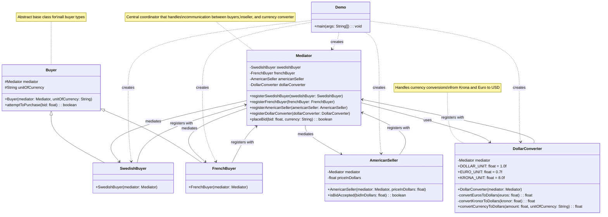

# Lab 9 Task 2 - Mediator Pattern Class Diagram

## Pattern Explanation

### Mediator Pattern Components:

1. **Mediator**: Central coordinator that encapsulates how multiple objects interact
2. **Colleagues**: 
   - `SwedishBuyer` & `FrenchBuyer` (buyers with different currencies)
   - `AmericanSeller` (accepts/rejects bids in USD)
   - `DollarConverter` (currency conversion service)

### Key Relationships:

- **Registration**: All components register themselves with the mediator
- **Communication**: Buyers don't directly communicate with seller or converter
- **Coordination**: Mediator handles bid placement, currency conversion, and seller interaction
- **Decoupling**: Components are loosely coupled through the mediator interface

### Workflow:
1. Buyer calls `attemptToPurchase()`
2. Mediator receives `placeBid()` call
3. Mediator uses DollarConverter to convert currency
4. Mediator checks with AmericanSeller for bid acceptance
5. Result is returned through the mediator chain